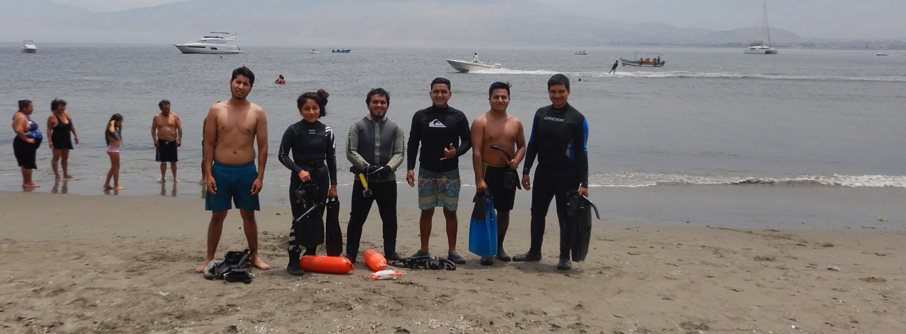

>Somos Bucea ConCiencia, un grupo de personas liderados por investigadores, buzos, y apasionados por el mar, la vida marina y su conservación. Buscamos concientizar a las personas mostrándoles directamente todo lo que en el mar habita y el impacto actual que ocurre. Esto lo hacemos mediante el buceo, apnea y la fotografía.
>
>En los posts siguientes les mostraremos un poco de lo nuestras salidas oficiales como grupo, contenido sobre las especies que vemos, y los lugares que exploramos.Tenemos la esperanza de que más gente entusiasmada con el mar se sume al grupo y seamos más los que busquemos conocer, cuidar y valorar nuestro maravilloso mar.

